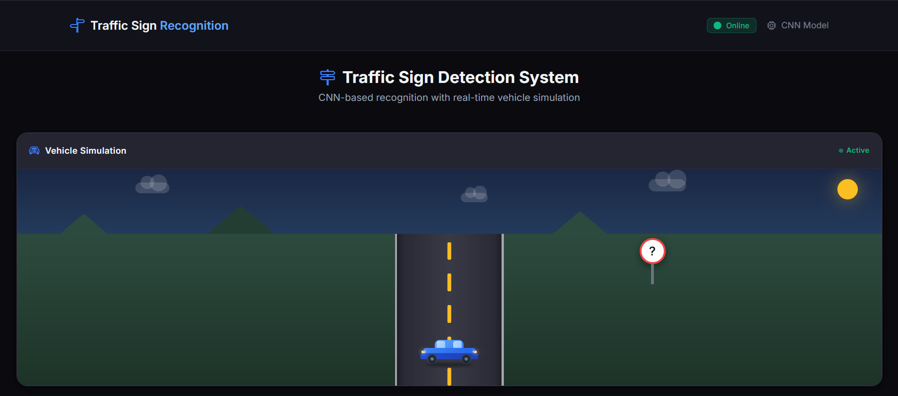
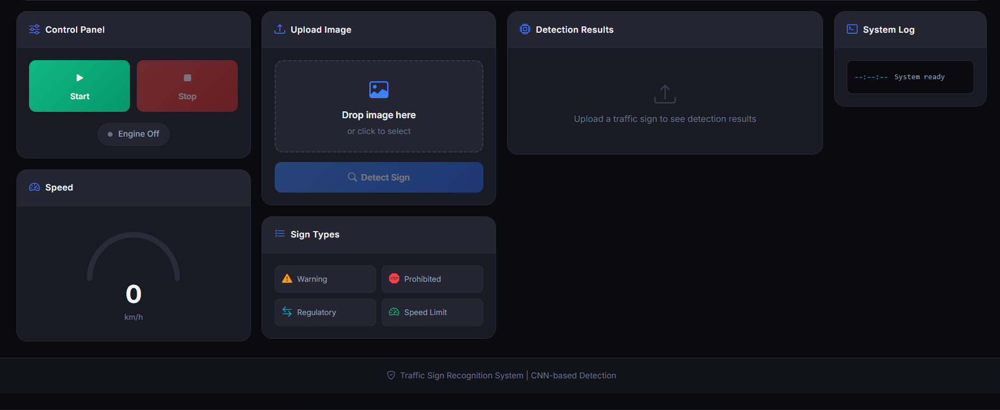
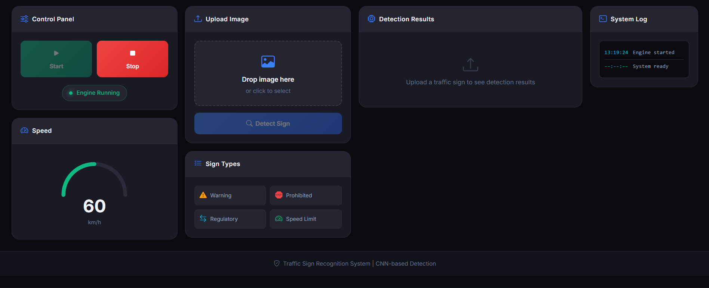
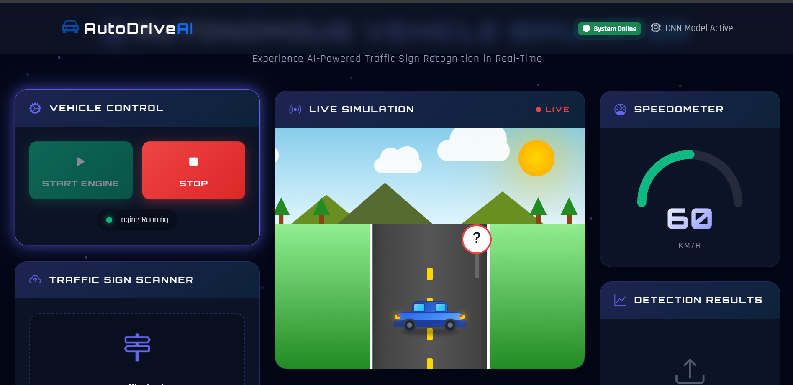
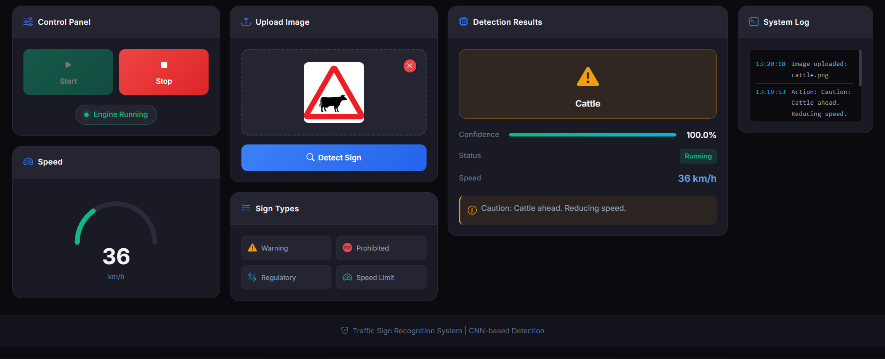
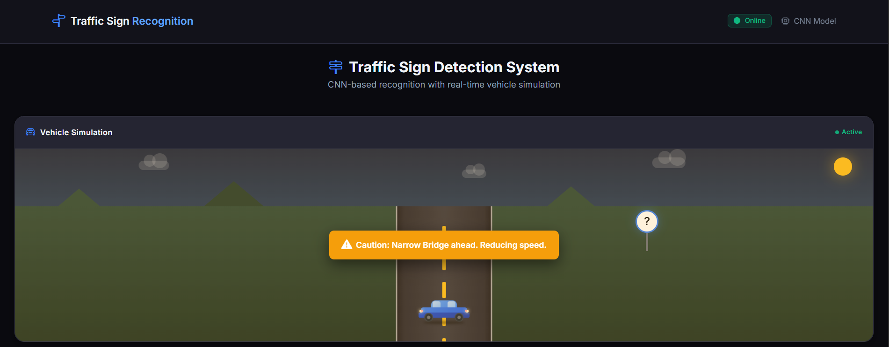
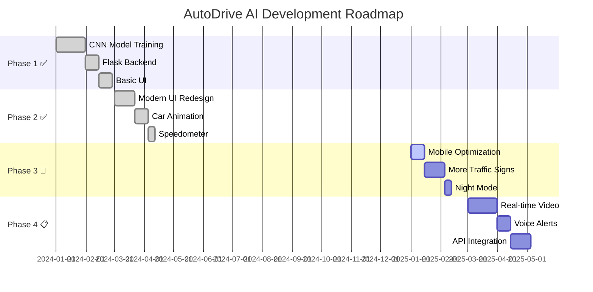

<!-- Animated Header -->
<p align="center">
  
</p>

<!-- Typing Animation -->
<p align="center">
  <h2><span id="text">🤖 AI-Powered Autonomous Vehicle Simulator
🎯 Real-Time Traffic Sign Detection
⚡ CNN Deep Learning Architecture</span></h2>
</p>

<!-- Badges Row 1 - Status -->
<p align="center">
  
  
  
  
  
</p>

<!-- Badges Row 2 - Technologies -->
<p align="center">
  
  
  
  
  
</p>

<!-- Badges Row 3 - Additional -->
<p align="center">
  
  
  
</p>

<!-- Divider -->
<p align="center">
  
</p>

<!-- Quick Navigation -->
<h2 align="center">🧭 Quick Navigation</h2>

<p align="center">
  <a href="#-overview">Overview</a> •
  <a href="#-features">Features</a> •
  <a href="#-architecture">Architecture</a> •
  <a href="#-quick-start">Quick Start</a> •
  <a href="#-demo">Demo</a> •
  <a href="#-tech-stack">Tech Stack</a> •
  <a href="#-roadmap">Roadmap</a> •
  <a href="#-contributing">Contributing</a>
</p>

---

## 🎯 Overview

<table>
<tr>
<td width="50%">

### 🤔 What is AutoDrive AI?

**AutoDrive AI** is an intelligent autonomous vehicle simulator that uses **Convolutional Neural Networks (CNN)** to recognize traffic signs in real-time and automatically adjust vehicle behavior accordingly.

This project simulates how Tesla-like self-driving cars interpret and respond to road signs, providing an interactive web-based experience where users can:

- 🚗 Start/Stop a virtual car
- 📸 Upload traffic sign images
- 🧠 Watch AI detect and classify signs
- ⚡ See the car respond in real-time

</td>
<td width="50%">

### 💡 Why This Project?

| Problem | Solution |
|:--------|:---------|
| 🚧 Manual driving requires constant attention | ✅ AI automates sign recognition |
| 🎓 Learning CNN is abstract | ✅ Visual, interactive demonstration |
| 🔬 Complex ML feels inaccessible | ✅ User-friendly web interface |
| 📊 Hard to visualize AI decisions | ✅ Real-time car behavior changes |

> *"Bridging the gap between complex deep learning and intuitive user experience"*

</td>
</tr>
</table>

---

## ✨ Features

<table align="center">
<tr>
<th>🎯 Feature</th>
<th>📝 Description</th>
<th>✅ Status</th>
</tr>
<tr>
<td>🤖 <b>CNN Classification</b></td>
<td>9-class traffic sign recognition with high accuracy</td>
<td>✅ Complete</td>
</tr>
<tr>
<td>🚗 <b>Vehicle Animation</b></td>
<td>Interactive car with wheels, lights, and movement</td>
<td>✅ Complete</td>
</tr>
<tr>
<td>📊 <b>Live Speedometer</b></td>
<td>Animated gauge showing real-time speed changes</td>
<td>✅ Complete</td>
</tr>
<tr>
<td>⚠️ <b>Warning System</b></td>
<td>Visual alerts for caution signs (cattle, narrow road)</td>
<td>✅ Complete</td>
</tr>
<tr>
<td>🛑 <b>Stop Detection</b></td>
<td>Automatic vehicle stop on No Entry signs</td>
<td>✅ Complete</td>
</tr>
<tr>
<td>📤 <b>Drag & Drop Upload</b></td>
<td>Modern file upload with image preview</td>
<td>✅ Complete</td>
</tr>
<tr>
<td>🎨 <b>Glass-morphism UI</b></td>
<td>Stunning modern design with animations</td>
<td>✅ Complete</td>
</tr>
<tr>
<td>📱 <b>Responsive Design</b></td>
<td>Works on desktop and mobile devices</td>
<td>✅ Complete</td>
</tr>
<tr>
<td>📝 <b>System Logging</b></td>
<td>Real-time activity log for debugging</td>
<td>✅ Complete</td>
</tr>
</table>

### 🚦 Supported Traffic Signs

| Sign | Action | Speed Effect |
|:-----|:-------|:-------------|
| 🚫 No Entry | Vehicle Stops | 0 km/h |
| 🚀 Speed Limit 90 | Speed Up | 90 km/h |
| ⚠️ Narrow Road | Caution + Slow | 36 km/h |
| ⚠️ Narrow Bridge | Caution + Slow | 36 km/h |
| 🐄 Cattle | Warning Alert | 36 km/h |
| 🔀 Give Way | Reduce Speed | 42 km/h |
| ↩️ No Left Turn | Restriction Notice | 60 km/h |
| ↪️ No Right Turn | Restriction Notice | 60 km/h |
| 🚗 No Overtaking | Restriction Notice | 60 km/h |

---

## 🏗️ Architecture

<details>
<summary><b>📐 Click to expand System Architecture</b></summary>

```
┌─────────────────────────────────────────────────────────────────────────────┐
│                          🚗 AUTODRIVE AI ARCHITECTURE                        │
├─────────────────────────────────────────────────────────────────────────────┤
│                                                                             │
│  ┌─────────────┐     ┌─────────────────┐     ┌─────────────────────────┐   │
│  │   CLIENT    │     │   FLASK SERVER  │     │      CNN MODEL          │   │
│  │  (Browser)  │────▶│   (app.py)      │────▶│  (traffic_sign_cnn.h5)  │   │
│  └─────────────┘     └─────────────────┘     └─────────────────────────┘   │
│        │                     │                          │                   │
│        │                     │                          │                   │
│        ▼                     ▼                          ▼                   │
│  ┌─────────────┐     ┌─────────────────┐     ┌─────────────────────────┐   │
│  │  Bootstrap  │     │  Image Upload   │     │   TensorFlow/Keras      │   │
│  │  + CSS      │     │  & Processing   │     │   Prediction Engine     │   │
│  │  + JS       │     │                 │     │                         │   │
│  └─────────────┘     └─────────────────┘     └─────────────────────────┘   │
│        │                     │                          │                   │
│        │                     │                          │                   │
│        ▼                     ▼                          ▼                   │
│  ┌─────────────────────────────────────────────────────────────────────┐   │
│  │                     🎮 INTERACTIVE SIMULATION                        │   │
│  │  ┌─────────┐  ┌───────────┐  ┌────────────┐  ┌──────────────────┐   │   │
│  │  │  Road   │  │    Car    │  │ Speedometer│  │ Detection Panel  │   │   │
│  │  │Animation│  │ Animation │  │   Gauge    │  │   + Results      │   │   │
│  │  └─────────┘  └───────────┘  └────────────┘  └──────────────────┘   │   │
│  └─────────────────────────────────────────────────────────────────────┘   │
│                                                                             │
└─────────────────────────────────────────────────────────────────────────────┘

                              DATA FLOW
                              ─────────
     ┌──────────┐        ┌──────────────┐        ┌───────────────┐
     │  Upload  │───────▶│   Predict    │───────▶│ Decide Action │
     │  Image   │        │   (CNN)      │        │ (Speed/Stop)  │
     └──────────┘        └──────────────┘        └───────────────┘
                                                        │
                                                        ▼
                              ┌──────────────────────────────────┐
                              │        Update UI                 │
                              │  • Car Animation                 │
                              │  • Speedometer                   │
                              │  • Warning Overlays              │
                              │  • Detection Results             │
                              └──────────────────────────────────┘
```

</details>

<details>
<summary><b>🧠 CNN Model Architecture</b></summary>

```
┌─────────────────────────────────────────────────────────────────┐
│                    CNN MODEL ARCHITECTURE                        │
├─────────────────────────────────────────────────────────────────┤
│                                                                 │
│  INPUT LAYER                                                    │
│  └── Image: 64x64x3 (RGB)                                       │
│                                                                 │
│  CONVOLUTIONAL BLOCKS                                           │
│  ├── Conv2D (32 filters, 3x3) + ReLU + MaxPool                 │
│  ├── Conv2D (64 filters, 3x3) + ReLU + MaxPool                 │
│  └── Conv2D (128 filters, 3x3) + ReLU + MaxPool                │
│                                                                 │
│  FULLY CONNECTED                                                │
│  ├── Flatten                                                    │
│  ├── Dense (256) + ReLU + Dropout(0.5)                         │
│  └── Dense (9) + Softmax                                        │
│                                                                 │
│  OUTPUT                                                         │
│  └── 9 Classes: cattle, give_way, narrow_bridge,               │
│                 narrow_road, no_entry, no_left_turn,           │
│                 no_overtaking, no_right_turn, speed_limit_90   │
│                                                                 │
└─────────────────────────────────────────────────────────────────┘
```

</details>

---

## 📁 Project Structure

```
🚗 Traffic-Sign-Detection-CNN/
│
├── 📄 app.py                    # Flask application & routes
├── 📄 README.md                 # Project documentation
│
├── 📁 model/
│   ├── 🧠 traffic_sign_cnn.h5   # Trained CNN model
│   └── 🧠 traffic_sign_cnn_1.h5 # Backup model
│
├── 📁 notebook/
│   └── 📓 train.ipynb           # Model training notebook
│
├── 📁 dataset/
│   ├── 🐄 cattle/               # Cattle warning signs
│   ├── 🔀 give_way/             # Give way signs
│   ├── 🌉 narrow_bridge/        # Narrow bridge signs
│   ├── ↔️ narrow_road/          # Narrow road signs
│   ├── 🚫 no_entry/             # No entry signs
│   ├── ↩️ no_left_turn/         # No left turn signs
│   ├── 🚗 no_overtaking/        # No overtaking signs
│   ├── ↪️ no_right_turn/        # No right turn signs
│   └── 🚀 speed_limit_90/       # Speed limit signs
│
├── 📁 templates/
│   └── 🌐 index.html            # Main UI template
│
├── 📁 static/
│   └── 🎨 style.css             # Custom styles & animations
│
├── 📁 uploads/                   # Uploaded images (temp)
│
└── 📁 test_images/              # Test images for demo
```

---

## 🚀 Quick Start

### 📋 Prerequisites

<table>
<tr>
<td>

| Requirement | Version |
|:------------|:--------|
| 🐍 Python | 3.10+ |
| 📦 pip | Latest |
| 🧠 TensorFlow | 2.x |
| 🌐 Flask | 2.x |

</td>
<td>

```bash
# Check Python version
python --version

# Check pip version
pip --version
```

</td>
</tr>
</table>

### ⚙️ Installation

```bash
# 1️⃣ Clone the repository
git clone https://github.com/dinraj910/autodrive-ai.git
cd autodrive-ai

# 2️⃣ Create virtual environment (recommended)
python -m venv venv
source venv/bin/activate  # On Windows: venv\Scripts\activate

# 3️⃣ Install dependencies
pip install -r requirements.txt

# 4️⃣ Run the application
python app.py
```

### 🎮 Usage

```bash
# Start the server
python app.py

# Open in browser
# Navigate to: http://127.0.0.1:5000
```

<details>
<summary><b>📦 Requirements.txt</b></summary>

```txt
flask>=2.0.0
tensorflow>=2.10.0
keras>=2.10.0
numpy>=1.21.0
pillow>=9.0.0
```

</details>

---

## 🎬 Demo

<!-- Video Demo Section -->
<p align="center">
  <b>🎥 Watch the Full Demo</b>
</p>

<p align="center">
  <a href="screenshots/demo.mp4">
    
  </a>
</p>

<p align="center">
  <video src="screenshots/demo.mp4" controls width="80%">
    Your browser does not support the video tag.
  </video>
</p>

https://github.com/user-attachments/assets/demo.mp4

> 📹 *Click above to watch the full demonstration of AutoDrive AI in action!*

---

### 📸 Screenshots

<p align="center">
  <b>🖼️ Visual Tour of AutoDrive AI</b>
</p>

<table align="center">
<tr>
<td align="center" width="50%">
<b>🏠 Screenshot 1</b>
<br><br>

</td>
<td align="center" width="50%">
<b>🚗 Screenshot 2</b>
<br><br>

</td>
</tr>
<tr>
<td align="center">
<b>📊 Screenshot 3</b>
<br><br>

</td>
<td align="center">
<b>⚠️ Screenshot 4</b>
<br><br>

</td>
</tr>
<tr>
<td align="center">
<b>🎯 Screenshot 5</b>
<br><br>

</td>
<td align="center">
<b>✨ Screenshot 6</b>
<br><br>

</td>
</tr>
</table>

---

## ⚙️ Configuration

### 🔐 Environment Variables

| Variable | Description | Default |
|:---------|:------------|:--------|
| `FLASK_ENV` | Environment mode | `development` |
| `FLASK_DEBUG` | Debug mode | `True` |
| `UPLOAD_FOLDER` | Image upload directory | `uploads/` |
| `MODEL_PATH` | Path to CNN model | `model/traffic_sign_cnn.h5` |
| `IMG_SIZE` | Input image dimensions | `(64, 64)` |

### 🎛️ Model Parameters

```python
# Image preprocessing
IMG_SIZE = (64, 64)           # Input dimensions
NORMALIZE = True               # Divide by 255.0

# Confidence threshold
MIN_CONFIDENCE = 0.6          # Below this = "Uncertain"

# Default speed
DEFAULT_SPEED = 60            # km/h
```

---

## 🛠️ Tech Stack

<table align="center">
<tr>
<td align="center" width="100">

<br><b>Python</b>
</td>
<td align="center" width="100">

<br><b>TensorFlow</b>
</td>
<td align="center" width="100">

<br><b>Flask</b>
</td>
<td align="center" width="100">

<br><b>Bootstrap</b>
</td>
<td align="center" width="100">

<br><b>HTML5</b>
</td>
<td align="center" width="100">

<br><b>CSS3</b>
</td>
<td align="center" width="100">

<br><b>JavaScript</b>
</td>
</tr>
</table>

### 📚 Key Libraries

| Category | Libraries |
|:---------|:----------|
| 🧠 **Machine Learning** | TensorFlow, Keras, NumPy |
| 🖼️ **Image Processing** | Pillow, Keras Preprocessing |
| 🌐 **Web Framework** | Flask, Jinja2 |
| 🎨 **Frontend** | Bootstrap 5, Bootstrap Icons |
| 📊 **Visualization** | CSS Animations, SVG |

---

## 📈 Performance Metrics

<table align="center">
<tr>
<th>📊 Metric</th>
<th>📈 Value</th>
<th>📝 Notes</th>
</tr>
<tr>
<td>🎯 <b>Model Accuracy</b></td>
<td>~95%+</td>
<td>On validation set</td>
</tr>
<tr>
<td>⚡ <b>Inference Time</b></td>
<td><100ms</td>
<td>Per image prediction</td>
</tr>
<tr>
<td>📦 <b>Model Size</b></td>
<td>~5MB</td>
<td>Optimized .h5 format</td>
</tr>
<tr>
<td>🖼️ <b>Input Resolution</b></td>
<td>64x64</td>
<td>RGB images</td>
</tr>
<tr>
<td>🏷️ <b>Classes</b></td>
<td>9</td>
<td>Traffic sign types</td>
</tr>
<tr>
<td>📱 <b>UI Response</b></td>
<td>60 FPS</td>
<td>Smooth animations</td>
</tr>
</table>

---

## 🗺️ Roadmap



### 🎯 Future Enhancements

- [ ] 📹 Real-time video/webcam detection
- [ ] 🌙 Dark/Night mode toggle
- [ ] 🔊 Audio alerts for warnings
- [ ] 📱 Progressive Web App (PWA)
- [ ] 🗣️ Voice command support
- [ ] 🌍 Multi-language support
- [ ] 📊 Detection history dashboard
- [ ] 🔗 REST API endpoints
- [ ] 🚦 More traffic sign classes (20+)
- [ ] 🎮 Gamification elements

---

## 🤝 Contributing

Contributions are what make the open source community amazing! Any contributions you make are **greatly appreciated**.

<details>
<summary><b>📋 Contribution Guidelines</b></summary>

1. **Fork** the Project
2. **Create** your Feature Branch
   ```bash
   git checkout -b feature/AmazingFeature
   ```
3. **Commit** your Changes
   ```bash
   git commit -m '✨ Add some AmazingFeature'
   ```
4. **Push** to the Branch
   ```bash
   git push origin feature/AmazingFeature
   ```
5. **Open** a Pull Request

### 📝 Commit Convention

| Emoji | Type | Description |
|:------|:-----|:------------|
| ✨ | `feat` | New feature |
| 🐛 | `fix` | Bug fix |
| 📝 | `docs` | Documentation |
| 🎨 | `style` | UI/Style changes |
| ♻️ | `refactor` | Code refactoring |
| ⚡ | `perf` | Performance |
| 🧪 | `test` | Testing |

</details>

---

## 📄 License

<p align="center">
  
</p>

Distributed under the MIT License. See `LICENSE` for more information.

```
MIT License

Copyright (c) 2024 Your Name

Permission is hereby granted, free of charge, to any person obtaining a copy
of this software and associated documentation files (the "Software"), to deal
in the Software without restriction...
```

---

## 👨‍💻 Author

<h3 align="center">DINRAJ K DINESH</h3>

<p align="center">
  <i>🚀 Full Stack Developer | 🤖 AI/ML Enthusiast | 💡 Problem Solver</i>
</p>

<p align="center">
  <a href="https://github.com/dinraj910">
    
  </a>
  <a href="https://linkedin.com/in/yourusername">
    
  </a>
  <a href="https://twitter.com/yourusername">
    
  </a>
  <a href="dinrajdinesh564@gmail.com">
    
  </a>
  <a href="https://dinrajkdinesh.netlify.app/">
    
  </a>
</p>

---

## 🙏 Acknowledgments

<table align="center">
<tr>
<td align="center">

<br>TensorFlow Team
</td>
<td align="center">

<br>Bootstrap
</td>
<td align="center">

<br>Flask
</td>
<td align="center">

<br>Open Source Community
</td>
</tr>
</table>

- 🎓 Dataset inspiration from traffic sign databases
- 💡 UI/UX inspiration from modern automotive dashboards
- 🤖 Deep Learning concepts from academic papers
- ❤️ Special thanks to all contributors!

---

## 📊 Star History

<p align="center">
  <a href="https://star-history.com/#yourusername/autodrive-ai&Date">
    
  </a>
</p>

---

## 💖 Show Your Support

<p align="center">
  Give a ⭐ if this project helped you!
</p>

<p align="center">
  <a href="https://www.buymeacoffee.com/yourusername">
    
  </a>
</p>

<p align="center">
  <a href="https://github.com/yourusername/autodrive-ai/stargazers">
    
  </a>
  <a href="https://github.com/yourusername/autodrive-ai/network/members">
    
  </a>
  <a href="https://github.com/yourusername/autodrive-ai/watchers">
    
  </a>
</p>

---

<p align="center">
  <b>🚗 Drive into the Future with AutoDrive AI! 🚀</b>
</p>

<p align="center">
  Made with ❤️ and ☕ by <a href="https://github.com/yourusername">Your Name</a>
</p>

<!-- Animated Footer -->
<p align="center">
  
</p>
